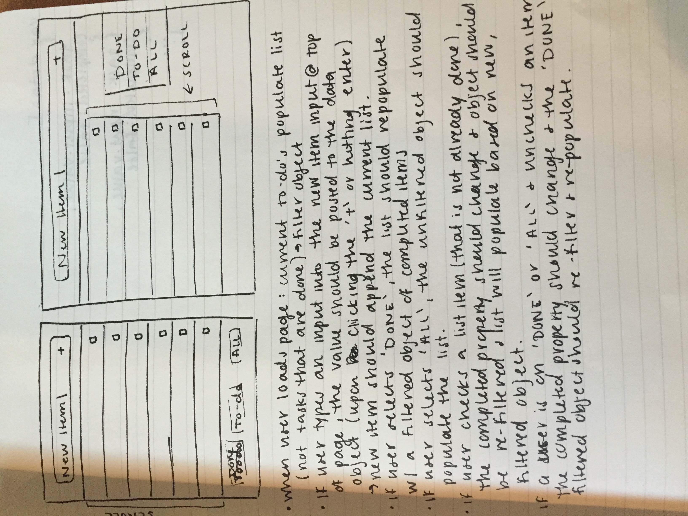
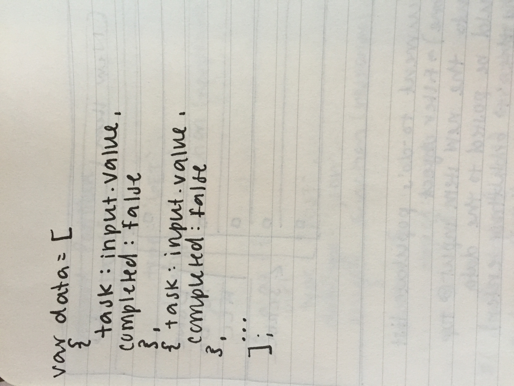

The checked task filtered views (navigated by the bottom three buttons is not fully functioning). The views are correct but the hash changes and the ajax put requests seem to be missing something.
